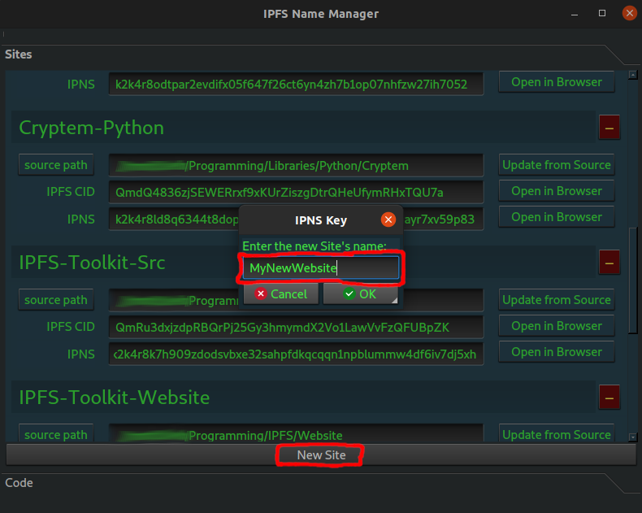
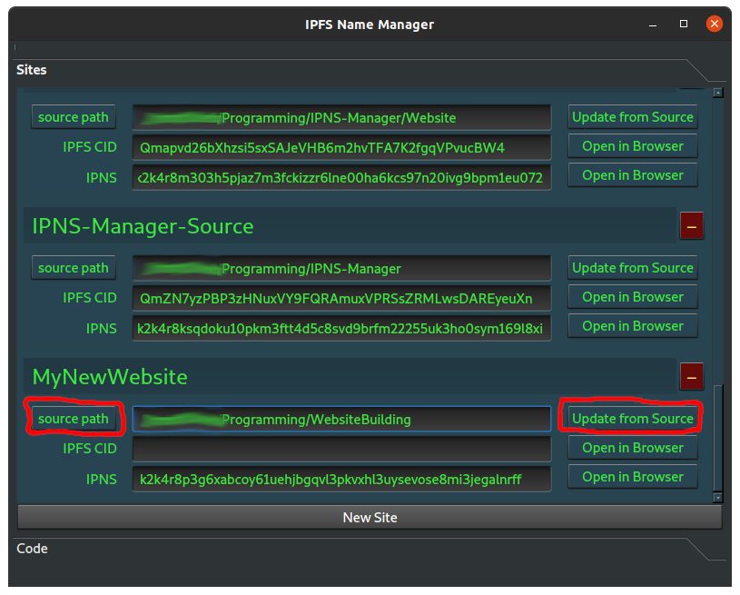
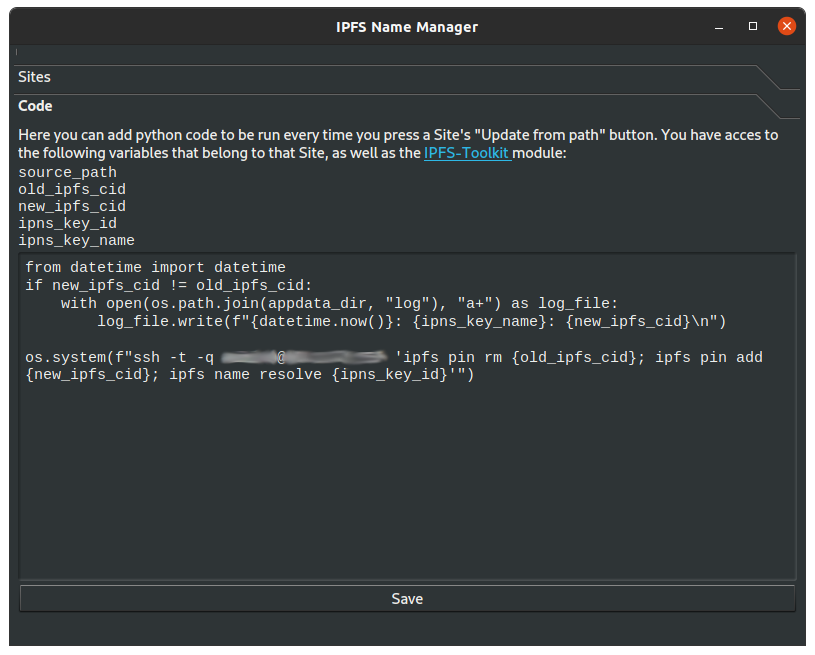

# IPNS-Manager
IPFS-Manager is a GUI program for managing [IPFS (Interplanetary File System)](https://ipfs.io) name keys. It's purpose is to make it easier to manage websites (and other content) hosted on IPFS with IPNS keys (IPFS Name System).

Built with the PyQt5 wrapper for the Qt graphics framework and the IPFS-Toolkit API for IPFS. 

## Installation
You can download and run the binaries in the dist folder (Linux & Windows x86_64). If you are using a different operating system, you can run the program from source.

### Run from Source
- This program is written in the Python programming language. Install it and its package manager pip.
On debian-based linux systems, install with:
`sudo apt install python3`  
`sudo apt install python3-pip`

- Install the Python packages (libraries) which this project depends on:
`pip install PyQt5`  
`pip install IPFS-Toolkit`

On linux, also run:
`sudo apt install pyqt5-tools-dev`

- Download the source code.
- Make sure IPFS is running (`ifps daemon`), and run the project:  
`python3 IPNS-Manager`

## Usage
### Adding Sites
Make sure IPFS is running on your computer before you run this program.

- Click on the "New Site" button at the bottom of the Sites page, enter a name for the Site (this name is only used on your computer for you to call your Site, and you will always be able to change it laterr). A new IPNS key will be automatically generated and displayed in the new box that appears in the page's Sites list.
- Add a source path for your Site by pressing the "source path" button to choose a file or folder or by pasting the path to the source of your website/other content in the field next to the button.
- Click the "Update from Source" button to upload the Site source to IPFS and assgn it to the IPNS key.
- You can view the Site on IPFS in your browser by clicking one of the "Open in Browser" buttons. The upper button opens the Site using its CID, wheras the lower button opens the Site using its IPNS key (which may take a longer time to load).

### Adding Custom Code
You can add your own Python code to be executed whenever you press a Site's "Update from Source". At the bottom of the IPNS-Manager window, press the "Code" tab. This will open a new view with a field in which you can paste a small python script. In this code, you can access the newly updated Site's data using the following variables:

    source_path  
    old_ipfs_cid  
    new_ipfs_cid  
    ipns_key_id  
    ipns_key_name 

You also have access to the [IPFS-Toolkit](https://ipfs.io/ipns/k2k4r8m2dzqi5s8jm3shm77sr1728ex7bsds0fk6e9gkf2ld2f3mnhcy) library (which contains the `IPFS_API`, `IPFS_DataTransmission` and `IPFS_LNS` modules), as well as all global variables in the LoadUI.py script from IPNS-Manager's source code.

Examples:

    # Write to log file:
    from datetime import datetime
    if new_ipfs_cid != old_ipfs_cid:
        with open(os.path.join(appdata_dir, "log"), "a+") as log_file:  # appdata_dir is a global varibale from LoadUI.py
            log_file.write(f"{datetime.now()}: {ipns_key_name}: {new_ipfs_cid}\n")

    # ssh into an always-online-computer with ipfs installed and pin the updated Site's CID  
    os.system(f"ssh -t -q admin@IP_ADDRESS 'ipfs pin rm {old_ipfs_cid}; ipfs pin add {new_ipfs_cid}; ipfs name resolve {ipns_key_id}'")
  
  The "Save" button saves your code to appdata. The "Update from Source" button however always executes the latest code you've written, regardless of whether it has been saved or not.
  To debug your code, run IPNS-Manager from a terminal window. All `print` statements in your code will be printed on the terminal.

      