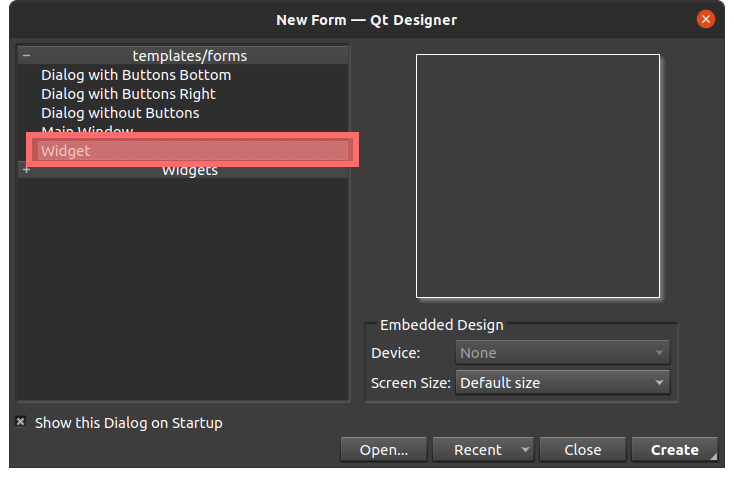

# IPNS-Manager
IPFS-Manager is a GUI program for managing [IPFS (InterPlanetary File System)](https://ipfs.io) name keys. Its purpose is to make it easier to manage websites (and other content) hosted on IPFS with IPNS keys (IPFS Name System).

Built in Python with the [PyQt5](https://pypi.org/project/PyQt5/) wrapper for the Qt graphics framework and the [IPFS-Toolkit](https://github.com/emendir/IPFS-Toolkit-Python) API for IPFS. 

## Prerequisite Knowledge and Understanding
This program is built for people who work with IPFS and understand the basic concepts of how it works, including [IPNS (InterPlanetary Name System)](http://docs.ipfs.io.ipns.localhost:8080/concepts/ipns/).

## Installation
You can download and run the binary in the dist folder if you're using a Linux or Windows x86_64 computer (tested on Ubuntu 20 and Windows 10). If you are using a different operating system, you can run the program from source and try to create a binary by running the "build.py" script.

### Run from Source
- This program is written in the Python programming language. Install it and its package manager pip. Use at a version of at least 3.7.

  On Debian-based Linux systems, install with:  
  `sudo apt install python3`  
  `sudo apt install python3-pip`

  On windows, it is recommended not to install python from its app store as that has in some tests led to difficult-to-find-problems. Download it from the official website instead: https://python.org.

- Install the Python packages (libraries) which this project depends on:  
  `pip install PyQt5>=5.12`  
  `pip install IPFS-Toolkit>=0.2.0`
  (you may need to use `pip3` instead of `pip` in these two commands)
  

  On Linux, you may need to first run:
  `sudo apt install pyqt5-dev`

- Download the source code:  
  from IPFS: `ipfs get $(ipfs name resolve k2k4r8ksqdoku10pkm3ftt4d5c8svd9brfm22255uk3ho0sym169l8xi) -o IPNS-Manager`  
  from Github: `git clone https://github.com/emendir/IPNS-Manager`
- Make sure IPFS is running (`ifps daemon`), and run the project:  
`python3 IPNS-Manager`  
or (on some systems)  
`python IPNS-Manager`

Tested on Ubuntu-20 with Python3.8 and ipfs v0.9.1.

## Usage
### Adding Sites
Make sure IPFS is running on your computer before you run this program.

- Click on the "New Site" button at the bottom of the Sites page, enter a name for the Site (this name is only used on your computer for you to call your Site, and you will always be able to change it laterr). A new IPNS key will be automatically generated and displayed in the new box that appears in the page's Sites list.
- Add a source path for your Site by pressing the "source path" button to choose a file or folder or by pasting the path to the source of your website/other content in the field next to the button.
- Click the "Update from Source" button to upload the Site source to IPFS and assgn it to the IPNS key.
- You can view the Site on IPFS in your browser by clicking one of the "Open in Browser" buttons. The upper button opens the Site using its CID, wheras the lower button opens the Site using its IPNS key (which may take a longer time to load).


# Extending Functionality
INS-Manager has two different features that allow you to extend its functionality: __custom code__ and __plugins__.  
IPNS' __custom code__ feature allows you to quickly and easily add one or a few lines of python code to be executed every time a user updates a Site. 
IPNS' __plugin__ framework allows you to develop plugins with graphical user interfaces that can be integrated into IPNS-Manager and used by people with no programming skill.


## Adding Custom Code
You can add your own Python code to be executed whenever you press a Site's "Update from Source".
You can choose whether you want your code to be executed before your Site is uploaded to IPFS or afterwards.
At the bottom of the IPNS-Manager window, press the "Pre-Publish Code Execution" or "Post-Publish Code Execution" tab, depending on when you want your code to be run. This will open a new view with a field in which you can paste a small python script. In this code, you can access the newly updated Site's data using the following variables:
```python
source_path  
old_ipfs_cid  
new_ipfs_cid  
ipns_key_id  
ipns_key_name 
```
You also have access to the [IPFS-Toolkit](https://ipfs.io/ipns/k2k4r8m2dzqi5s8jm3shm77sr1728ex7bsds0fk6e9gkf2ld2f3mnhcy) library (which contains the `IPFS_API`, `IPFS_DataTransmission` and `IPFS_LNS` modules), the os, shutil, pathlib, json & sys modules as well as all global variables in the LoadUI.py script from IPNS-Manager's source code, and the modules


Examples:
```python
# Write to log file:
from datetime import datetime
if new_ipfs_cid != old_ipfs_cid:
    with open(os.path.join(appdata_dir, "log"), "a+") as log_file:  # appdata_dir is a global varibale from LoadUI.py
        log_file.write(f"{datetime.now()}: {ipns_key_name}: {new_ipfs_cid}\n")

# ssh into an always-online-computer with ipfs installed and pin the updated Site's CID  
os.system(f"ssh -t -q admin@IP_ADDRESS 'ipfs pin rm {old_ipfs_cid}; ipfs pin add {new_ipfs_cid}; ipfs name resolve {ipns_key_id}'")
```
The "Save" button saves your code to appdata. The "Update from Source" button however always executes the latest code you've written, regardless of whether it has been saved or not.
To debug your code, run IPNS-Manager from a terminal window. All `print` statements in your code will be printed on the terminal.


# Building Plugins
In their simplest form, IPNS-Manager plugins consists of a python class named "Plugin" which defines the `PrePublish` and `PostPublish` functions and is coded in a file that lives in a folder called 'Plugins' located either inside [the project source directory, the same directory as the IPNS-Binary, or the IPNS-Manager's appdata path].
__Example of the simplest code for a plugin__:
```python
class Plugin:
  def PrePublish(self, source_path, old_ipfs_cid, ipns_key_id, ipns_key_name):
      """
      This function gets executed every time the user clicks a Site's
      'Update from Source' button, before the source is actually uploaded
      to IPFS.
      """
      pass

  def PostPublish(self, source_path, old_ipfs_cid, new_ipfs_cid, ipns_key_id, ipns_key_name):
      """
      This function gets executed every time the user clicks a Site's
      'Update from Source' button, after the source is uploaded to IPFS.
      """
      pass
```
The name of the class must be `Plugin`, whereas the filename in which the class is coded is irrevelevant (as long as the file has the `.py` extension and is located in one of the plugin directories mentioned above, IPNS-Manager will try to load it).

At this stage this simple plugin already has all the functionality of the IPNS-Manager's custom code feature, plus it can remember data stored in variables (attributes of `Plugin`) for the whole runtime of IPNS-Manager, not just the instantaneous execution of custom code's scripts.

## GUI Plugins
If you want your plugin to have a user interface that will appear as a toolbar tab alongside 'Sites', you can use the QtDesigner software (available for Linux, Windows and Mac) to create a user interface. [Here is an external tutorial to help getting started learning to use QtDesigner.](https://realpython.com/qt-designer-python/)

Let us use the provided SSHRemotePinning plugin as a demo-plugin to look into how GUI plugins can be created.
The SSHRemotePinning plugin consists of two files:
[SSHRemotePinning.py](./Plugins/SSHRemotePinning.py)
[SSHRemotePinning.ui](./Plugins/SSHRemotePinningUI.ui)

The [SSHRemotePinning.ui](./Plugins/SSHRemotePinningUI.ui) contains the markup code which defines the components of the GUI and their layout. We create this file in the QtDesigner software, choosing "QWidget" in the welcome screen:


I won't go into detail of how to use QtDesigner, learn that from one of the countless tutorials on the internet like [this one](https://realpython.com/qt-designer-python/).
For the SSHRemotePinning plugin, the finished UI in QtDesigner looks like this:


Now let's look at the Python code in [SSHRemotePinning.py](./Plugins/SSHRemotePinning.py).
The first thing we need to do is import the necessary libraries from the Qt GUI framework library (PyQt5):
```Python
# GUI framework libraries
from PyQt5 import QtCore, QtGui, QtWidgets
from PyQt5.uic import loadUiType
from PyQt5.QtWidgets import QMainWindow, QApplication, QMessageBox, QInputDialog
```
Then we need to load the markup code contained in [SSHRemotePinning.ui](./Plugins/SSHRemotePinningUI.ui) into a python class called `SSHRemotePinningWidget`: 
```Python
# importing the user interface created with Qt Designer saved as the
# 'SSHRemotePinningUI.ui' file as a class called SSHRemotePinningWidget
SSHRemotePinningWidget, QWidget = loadUiType(os.path.join(
    os.path.dirname(__file__), 'SSHRemotePinningUI.ui'))
```
Then we can define our Plugin class, inheriting the QWidget class and this SSHRemotePinningWidget class, with the necessary code to initialise them properly on runtime:
```Python
class Plugin(QWidget, SSHRemotePinningWidget):
    def __init__(self, mainwindow):
        """This is the constructor for this Pulgin class, meaning that it 
        gets executed once when the plugin is loaded."""
        super(Plugin, self).__init__()
        self.setupUi(self)
        self.mainwindow = mainwindow  # reference to IPNS-Manager's QMainWindow
```
This concludes setting up the framework that makes the plugin's GUI work, so now let's move on to the cool stuff!

### GUI Element Eventhandlers
We put our python code that we want to get executed when the the user manipulates GUI elements like pressing buttons or typing text into textboxes in functions called eventhandlers. You need to link eventhandlers to their respective events; this is usually done in the `__init__` function. Here are some examples from the SSHRemotePinning plugin:
```Python
        # setting eventhandlers for UI elements
        self.pinner_ip_txbx.textEdited.connect(self.OnPinnerIPChanged)
        self.pinner_username_txbx.textEdited.connect(
            self.OnPinnerUserNameChanged)
        self.test_btn.clicked.connect(self.OnTestBtnClicked)
```
Let's have a look at the first line. `self.pinner_ip_txbx` is the name of a textbox named `pinner_ip_txbx` of type `QLineEdit`, defined in QtDesigner and the [SSHRemotePinning.ui](./Plugins/SSHRemotePinningUI.ui) and an attribute of the `SSHRemotePinningWidget` class, and by extension an attribute of the `Plugin` class as it inherits `SSHRemotePinningWidget`.
The `pinner_ip_txbx` has an event called textEdited, which we are linking in this line of python code to a method in the `Plugin` class which we define and is in this case called `OnPinnerIPChanged`.

Let's have a quick look at the eventhandler:
```Python
    def OnPinnerIPChanged(self, event_args):
        self.pinner_ip = self.pinner_ip_txbx.text()
        self.SaveConfig()
```
The `event_args` will contain information about the event which calls this function. What information this is depends on the type of the event.

## Various Plugin Hacks
### Overriding the Site IPFS CID
A plugin can override IPNS' uploading of the Site-source-path to IPFS by specifying an IPFS CID that should be linked to the Site's IPNS-key instead.
This is done in the `PrePublish` function by returning a dict that contains the desired IPFS CID unter the key name `ipfs_cid`.

Example (complete plugin code except for the process of getting the desired IPFS-CID):
```Python
class Plugin:
  def PrePublish(self, source_path, old_ipfs_cid, ipns_key_id, ipns_key_name):
      # get desired IPFS CID for Site
      ipfs cid = ''
      return {"ipfs_cid": ipfs_cid}
 
  def PostPublish(self, source_path, old_ipfs_cid, new_ipfs_cid, ipns_key_id, ipns_key_name):
      pass
```
# Links:
This project's IPFS URL:  
[ipns://k2k4r8nismm5mmgrox2fci816xvj4l4cudnuc55gkfoealjuiaexbsup#IPNS-Manager](https://ipfs.io/ipns/k2k4r8nismm5mmgrox2fci816xvj4l4cudnuc55gkfoealjuiaexbsup#IPNS-Manager)